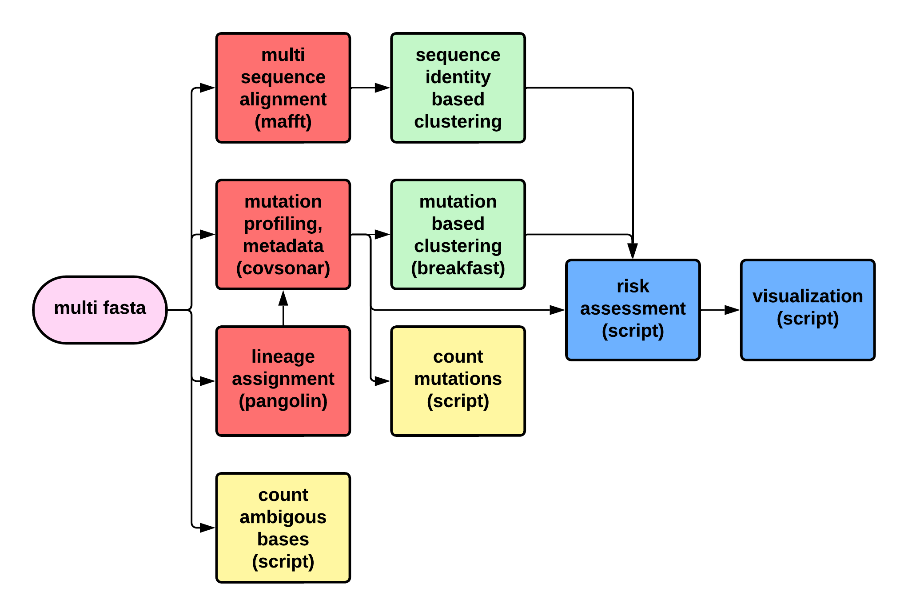

# RiskRanger :microbe: 


Repository containing the project 3 of the sc2 analysis workshop.



# getting started
First clone this repository recursively since the pipeline relies on tools like `CovSonar` and the `SARS2-RBD-escape-calculator` like this:
```
git clone --recurse-submodules https://github.com/fischer-hub/covvitz.git
```

# running the pipeline
To start the pipeline change into the project directory and run the follwing command in your terminal:
```
cd covvitz
nextflow riskranger.nf -profile conda,local
```

This will run the pipeline with all default parameters on the provided test data that can be found in the `data/` directory of the project.

# useful parameters
Following parameters could be useful when adjustig your pipeline runs.
```
conda_cache     Directory to store RiskRanger conda environments in. [default: 'conda']
input           Input multi fasta file containing sequences to analyze. [default: 'data/risk-assessment-sequences.fasta.gz']
database        Name for CovSonar database for mutation profiling. [default: 'risk.db']
outdir          Directory to store output and results in. [default: 'results']
help            Print this help message and exit. [default: 'false']
sonar_py        Path to CovSonar's sonar.py file. [default: 'lib/covsonar/sonar.py']
lin_aliases     Path to pango-designations lineage alias json file. [default: 'data/alias_key.json']
de_esc_vars     Path to file of de-escalated variants by ECDC. [default: 'data/de_escalated_variants.csv']
esc_calc_path   Path to jbloom's escape calulator module file. [default: 'lib/SARS2-RBD-escape-calc/escapecalculator.py']
cpu_per_task    Thread number to use for multithreaded tasks. [default: 4]
th_yellow       Threshold to bin sequences into yellow alert bin. [default: 5]
th_red          Threshold to bin sequences into red alert bin. [default: 16]
th_af           Minimal allel frequency threshold to drop sites in mutation site plot. [default: 0.3]
```

<p align="center">
    
</p>
